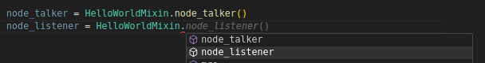

# ROS 2 Launch Mixin
The use of ROS 2 launch files seems scattered. In this repository we demonstrate how to structure ROS 2 launch files as **Mixins**. This offers some advantages:

- Code completion (so to understand what nodes / arguments a package offers / needs)
    
- Flexible composition (mix and match)
- Importable (but launch files inclusion still possible)
    - Include launch file
        ```python

        from launch.actions import IncludeLaunchDescription
        from launch.launch_description_sources import PythonLaunchDescriptionSource
        from launch.substitutions import PathJoinSubstitution
        from launch_ros.substitutions import FindPackageShare
        ```

    - **Mixins**
        ```python
        from ros2_launch_mixin.mixins import TurtleSimMixin, HelloWorldMixin
        ```

## How To
### General Setup
For the general setup, do:

1. In [package.xml](package.xml), add 
    ```xml
    <builtool_depend>ament_cmake_python</buildtool_depend>
    ```
2. In [CMakeLists.txt](CMakeLists.txt), add
    ```CMake
    find_package(ament_cmake_python REQUIRED)
    ...
    # install mixins
    ament_python_install_package(ros2_launch_mixin)
    ```
3. As in step 2, put your Mixins into [ros2_launch_mixin](ros2_launch_mixin) folder (or your desired name). Add an [__init__.py](ros2_launch_mixin/__init__.py) file.

### Create your Mixin
Create Mixin classes for your package, see [mixins.py](ros2_launch_mixin/mixins.py):

1. For each node, launch argument etc. create a static method
2. Prefix them with `node_` for nodes and `arg_` for arguments (this helps code completion)

### Example Use
An example use is shown in the [turtlesim_hello_world.launch.py](launch/turtlesim_hello_world.launch.py) launch file. You'll do things like

```python
ld = LaunchDescription()

# add turtlesim
ld.add_action(TurtleSimMixin.arg_node_name())
ld.add_action(TurtleSimMixin.node_turtlesim())
```

But you might also keep references (for event handlers)

```python
turtlesim_node = TurtleSimMixin.node_turtlesim()
```

You can also create new classes

```python
class MyNewLaunch(HelloWorldMixin, TurtleSimMixin):
    pass
```

## Code Completion Setup (VS Code)
For code completion extend the Python path:

1. In [settings.json](.vscode/settings.json) add
    ```json
    {
        "python.envFile": "${workspaceFolder}/.env"
    }
    ```
2. In [.env](.vscode/.env) add (requires `colcon build` this package)
    ```
    PYTHONPATH=../../install/ros2_launch_mixin/local/lib/python3.10
    ```
